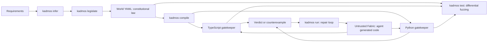

# Kadmos

[](https://github.com/substratum-labs/kadmos/actions/workflows/ci.yml)
[](LICENSE)


**Constitutional state machines for coding agents.** Kadmos turns a declarative World into TypeScript and Python gatekeepers, lets an agent build the surrounding application, and tests the two gatekeepers against the same generated transition sequences.

## Why Kadmos?

An LLM can write useful application code, but that code should not define its own permission to move money, change states, or invoke a directive. Kadmos separates the two concerns:

- **World:** A reviewed, bounded state machine with states, guards, context effects, invariants, and authorized directives.
- **Fabric:** Replaceable implementation code written by a person or an LLM. It calls the World gatekeeper before a governed transition.
- **Seam:** Generated ports and a deterministic checker expose the permitted transitions and return a refusal with a counterexample when a step violates the World.



The gatekeepers are pure in-process decision engines. Physical enforcement of network, filesystem, or process effects requires a separate host or execution broker to honor their verdicts. Kadmos alone does not sandbox Fabric or prevent it from bypassing the checker in the same process.

## BullMQ Drop-In Adapter (Developer Preview v0.x)

For supported BullMQ lifecycle APIs, replace the BullMQ import with `@substratum-labs/kadmos/adapters/bullmq`. The adapter exposes `Queue`, `Worker`, `Job`, and `QueueEvents`; pass the same ioredis connection to queue and worker:

```typescript
import Redis from 'ioredis';
import { Queue, Worker } from '@substratum-labs/kadmos/adapters/bullmq';

const connection = new Redis();
const queue = new Queue('emails', { connection });
const worker = new Worker('emails', async job => {
  console.log(job.data);
  return { delivered: true };
}, { connection });
await queue.add('send', { to: 'user@example.com' });
```

The adapter uses **zero Lua scripts**. A formally verified World state-machine gatekeeper authorizes lifecycle transitions, and transactional settlement rolls back checker state when a Redis write fails. The same World compiles to TypeScript and Python gatekeepers for polyglot compatibility. This v0.x surface targets the tested BullMQ lifecycle subset; review the [industrial replacement whitepaper](https://github.com/substratum-labs/substratum-internal/blob/main/design/kadmos/2026-09-28_kadmos_bullmq_replacement_whitepaper.md) for architecture, benchmarks, and migration boundaries.

## Three-minute quickstart

Requires Node.js 18+, Python 3.10+, and pnpm 10. From an npm-connected shell:

```bash
# Initialize a new governed project via npx:
npx @substratum-labs/kadmos init my-agent
cd my-agent
pnpm install
pnpm run compile
pnpm run test
```

The starter includes `world.yaml`, generated TypeScript and Python ports and checkers, example workers, tests, and CI. Open `world.yaml` first: its transitions and invariants are the rules the workers must obey. To visualize it, run `npx @substratum-labs/kadmos graph world.yaml --format html --out state_machine.html`.

## CLI reference

| Command | Purpose | Example |
| --- | --- | --- |
| `kadmos infer` | Extract candidate World and Fabric boundaries from prose or code, using local heuristics and optional LLM semantic extraction. | `kadmos infer requirements.md` |
| `kadmos legislate` | Resolve state-machine dilemmas with an ANSI terminal TUI wizard and record the chosen law. | `kadmos legislate requirements.md --interactive --out world.yaml` |
| `kadmos compile` | Project one World into zero-dependency TypeScript and Python ports and runtime gatekeepers. | `kadmos compile world.yaml --out generated --lang all` |
| `kadmos run` | Run a bounded, multi-turn CEGIS agent loop; refusals and compilation errors guide self-repair. | `kadmos run --prd requirements.md --max-turns 3` |
| `kadmos mcp` | Start a stdio Model Context Protocol server. | `kadmos mcp` |
| `kadmos test` | Differentially fuzz the TypeScript and Python checkers for cross-language bisimulation. | `kadmos test world.yaml --runs 30 --coverage` |
| `kadmos graph` | Render the World as Mermaid, Graphviz DOT, or HTML. | `kadmos graph world.yaml --format mermaid` |
| `kadmos init` | Bootstrap a governed project with example workers and tests. | `kadmos init my-agent --lang all` |

`kadmos test` also accepts `--steps`, `--seed`, and `--json`. `kadmos graph` accepts `--out` and, for HTML, `--open`. `kadmos init` supports `default`, `order-settlement`, and `circuit-breaker` templates. `kadmos run` needs an LLM provider credential for live generation; `--dry-run` previews the workflow without calling a provider.

## Model Context Protocol

Use this `mcpServers` entry in Claude Code or Cline's MCP settings, or in Cursor's `~/.cursor/mcp.json` (the latter can contain this complete JSON document):

```json
{
  "mcpServers": {
    "kadmos": {
      "command": "npx",
      "args": ["-y", "@substratum-labs/kadmos", "mcp"]
    }
  }
}
```

The server exposes `kadmos_infer`, `kadmos_legislate`, `kadmos_compile`, and `kadmos_step` over stdio JSON-RPC. The separate `kadmos-mcp` binary starts the same server after installation.

## Security and non-bypass boundary

- **Zero-Coercion:** Runtime inputs must have the expected primitive types; malformed values are refused instead of being coerced into legal transitions.
- **Private checker state:** ECMAScript `#private` fields keep a Fabric object from rewriting checker state by assigning public properties.
- **Monotonic identity sets:** Replayed or substituted request identities do not become valid through mutable caller-side collections.
- **Frozen Python module tables:** Generated Python gatekeepers freeze their rule tables against ordinary runtime mutation.

These properties harden the in-process decision boundary. A hostile process still needs an external broker to stop physical side effects that never call the checker.

## Development and release

```bash
pnpm install --frozen-lockfile
pnpm run typecheck
pnpm test
pnpm run test:fuzz
pnpm pack
```

`prepack` builds `dist` before packaging. The published package includes the CLI binaries, compiled runtime, README, and MIT license. Generated TypeScript and Python gatekeepers have no third-party runtime dependencies.

## License

[MIT](LICENSE) © 2026 Substratum Labs.
