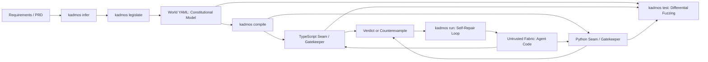

# Kadmos

[](https://github.com/substratum-labs/kadmos/actions/workflows/ci.yml)
[](LICENSE)


**A new paradigm for how coding agents build software.**

Kadmos brings declarative state-machine checks into AI-assisted software engineering. Humans review the critical domain model, and Kadmos compiles TypeScript and Python gatekeepers that check requested transitions at runtime and return refusals for observed violations.

---

## Why Kadmos?

### Model-Driven Core Generation vs. Code Review Fatigue
Coding agents can generate thousands of lines of application code in minutes. However, manually reviewing every line of AI-generated logic for subtle race conditions, invalid financial state transitions, or broken invariant rules is exhaustive and unsustainable.

Kadmos gives reviewers a declarative domain model alongside the Fabric code that uses it. The generated gatekeepers check requests against that model; reviewers must still assess whether the model captures intent and whether Fabric routes physical effects through the checker.

### Pragmatic Formalism: World, Fabric, and Seam
Kadmos rejects the academic trap of attempting to formally model 100% of an application (HTTP routing, JSON serialization, third-party SDK calls). Instead, it partitions systems into three pragmatic layers:

- **World (Constitutional Law)**: The critical core state machine. Contains explicit states, transitions, invariant predicates, bounded numeric contexts, and authorized directives. Humans review this policy; runtime checks enforce it for requests that pass through the gatekeeper.
- **Fabric (Replaceable Execution)**: Untrusted, disposable application code written by coding agents or humans (e.g., HTTP controllers, database queries, Redis workers).
- **Seam (The Membrane)**: Compiled, zero-dependency gatekeepers (`WorldChecker`) and typed ports (`ports.d.ts` / `ports.py`). Before a modeled physical effect, Fabric should request authorization from the gatekeeper. A refusal returns the accepted step history plus the refused attempt to guide diagnosis and repair.



---

## A Simple Example: Order Settlement

Here is how Kadmos models and governs an order lifecycle with financial value conservation.

### 1. The Model (`world.yaml`)
You define states, conservation invariants, and transitions:

```yaml
version: "kadmos.world.v0"
name: "OrderSettlementWorld"

states:
  - id: CREATED
    initial: true
  - id: PAID
  - id: FULFILLED
    terminal: true
  - id: CANCELLED
    terminal: true

context:
  order_amount:
    type: integer
    min: 1
    max: 10000000
    default: 5000
  escrow_balance:
    type: integer
    min: 0
    max: 10000000
    default: 0
  settled_amount:
    type: integer
    min: 0
    max: 10000000
    default: 0

invariants:
  - id: INV-CONSERVATION
    predicate: "escrow_balance + settled_amount <= order_amount"

transitions:
  - id: CONFIRM_PAYMENT
    from: CREATED
    to: PAID
    guard: "event.captured_amount == order_amount"
    directive: null
    effects:
      - "escrow_balance = order_amount"

  - id: DISPATCH_GOODS
    from: PAID
    to: FULFILLED
    guard: "escrow_balance == order_amount"
    directive: INVOKE_LOGISTICS_DISPATCH
    effects:
      - "settled_amount = escrow_balance"
      - "escrow_balance = 0"
```

### 2. The Compiled Seam (`WorldChecker`)
Compile the model into zero-dependency TypeScript and Python gatekeepers:

```bash
kadmos compile world.yaml --out src/world --lang all
```

The `kadmos.compiler.k02.v1` contract accepts an omitted World `directive`, `directive:`, or `directive: null` as no authorized directive. An explicit directive must be a nonempty string. Explicit empty context, invariant, and transition collections are valid. The generated TypeScript and Python seams typecheck/import for those Worlds; an empty invariant list adds no invented rule.

Each checker can take an optional initial context. Omitted or null/None uses World defaults; an object overlays them and becomes the remembered constructor seed. Bare or null/None `reset` restores that seed. Explicit `reset({})` restores World defaults, and any explicit object overlays those defaults without changing the seed. Malformed non-null context shapes and values fail `INVALID_BOUNDS`. Successful reset clears the one-step rollback savepoint; failed reset preserves it.

### 3. Fabric Under Governance
The coding agent writes application code constrained by the gatekeeper:

```typescript
import { WorldChecker } from "./world/world_checker.js";

export const checker = new WorldChecker();
let pending: Promise<void> = Promise.resolve();

export function processPayment(
  orderId: string,
  amount: number,
  persist: (orderId: string, state: string) => Promise<void>,
): Promise<void> {
  const operation = pending.then(async () => {
    const verdict = checker.step({
      transitionId: "CONFIRM_PAYMENT",
      eventPayload: { captured_amount: amount },
    });
    if (!verdict.allowed) {
      throw new Error(`Gatekeeper refusal: ${verdict.violation?.message}`);
    }
    try {
      await persist(orderId, verdict.currentState);
    } catch (error) {
      checker.rollbackLastStep();
      throw error;
    }
  });
  pending = operation.then(() => undefined, () => undefined);
  return operation;
}
```

This checker represents one order lifecycle; Fabric must associate each order with its own governed lifecycle. Calls using one checker must pass through the queue above so another step cannot replace its rollback savepoint during `await persist(...)`. Rejection leaves checker state unchanged and needs no rollback. On a physical failure after an allowed step, rollback restores only checker memory. If persistence committed before reporting failure, the caller needs a transaction, idempotency, or compensation; this example does not make database/API effects atomic with the checker.

Interpreted and generated TypeScript expose `rollbackLastStep()`; generated Python exposes `rollback_last_step()`. Each restores and consumes the pre-success checker snapshot. A refusal or failed reset leaves an earlier savepoint available, so call rollback only for a physical failure following an allowed step. Python's public state, context, and history are readable views; context/history reads return copies and assignments are rejected. Python introspection is outside this isolation boundary.

If an agent attempts an illegal transition (e.g., dispatching goods directly from `CREATED` without payment), the gatekeeper refuses that request and returns the accepted history plus the refused attempt as a diagnostic trace.

---

## Quick Start (Equipping Your Coding Agent)

Get started in seconds by running the interactive demo or initializing a governed project:

```bash
# 1. Run the 10-second interactive hallucination & repair walkthrough
npx @substratum-labs/kadmos demo

# 2. Initialize a governed starter project via npx
npx @substratum-labs/kadmos init my-agent --lang all
cd my-agent
pnpm install

# 3. Compile the starter World into TypeScript and Python seams
pnpm run compile

# 4. Run seeded differential checks on TypeScript and Python behavior
pnpm run test
```

`npx` uses the latest published package, which may differ from this source checkout. The local tarball verification described in this repository exercises the source package without publishing it.

### Equipping Your Agent (Claude Code / Cursor / Cline)
Kadmos ships with built-in configurations that turn your coding assistant into a governed agent:

1. **Via MCP**: Add Kadmos to your agent's MCP tools (see [Model Context Protocol](#model-context-protocol)). The agent gains `kadmos_infer`, `kadmos_legislate`, `kadmos_compile`, and `kadmos_step`.
2. **Via Skill**: Copy `skills/kadmos/` to your project's `.agents/skills/kadmos/`. Your agent automatically learns the 5-phase World-Fabric protocol.
3. **Graphing**: Visualize your state machine anytime:
   ```bash
   npx @substratum-labs/kadmos graph world.yaml --format html --out state_machine.html --open
   ```

---

## CLI Reference

| Command | Purpose | Example |
| --- | --- | --- |
| `kadmos demo` | Run an interactive 10-second walkthrough showing hallucination interception and CEGIS self-repair. | `kadmos demo` |
| `kadmos infer` | Extract candidate World and Fabric boundaries from prose requirements or existing code. | `kadmos infer requirements.md` |
| `kadmos legislate` | Resolve state-machine dilemmas with an interactive ANSI terminal TUI wizard. | `kadmos legislate requirements.md --interactive --out world.yaml` |
| `kadmos compile` | Project a World model into zero-dependency TypeScript and Python gatekeepers. | `kadmos compile world.yaml --out generated --lang all` |
| `kadmos run` | Run a bounded CEGIS agent self-repair loop guided by compilation and gatekeeper refusals. | `kadmos run --prd requirements.md --max-turns 3` |
| `kadmos mcp` | Start the stdio Model Context Protocol server for agent integration. | `kadmos mcp` |
| `kadmos test` | Compare sampled TypeScript interpreter and generated Python checker verdicts using seeded differential fuzzing. | `kadmos test world.yaml --runs 30 --coverage` |
| `kadmos graph` | Render the World state machine as Mermaid, Graphviz DOT, or interactive HTML. | `kadmos graph world.yaml --format mermaid` |
| `kadmos init` | Scaffold a new governed project with starter models, workers, and tests. | `kadmos init my-agent --lang all` |

`kadmos test` also accepts `--steps`, `--seed`, and `--json`. `kadmos init` supports `default`, `order-settlement`, and `circuit-breaker` templates.

---

## Model Context Protocol

Add this configuration to Claude Code, Cline, or Cursor's `~/.cursor/mcp.json`:

```json
{
  "mcpServers": {
    "kadmos": {
      "command": "npx",
      "args": ["-y", "@substratum-labs/kadmos", "mcp"]
    }
  }
}
```

The server exposes four standard JSON-RPC tools over stdio:
- `kadmos_infer`: Boundary and World candidate inference from PRDs.
- `kadmos_legislate`: Worst-case dilemma detection and legislation patching.
- `kadmos_compile`: Compiling World models into TypeScript/Python seams.
- `kadmos_step`: Interactive verification against runtime gatekeeper models.

The separate `kadmos-mcp` binary starts the same server directly after global installation.

---

## Agent Skill Integration

Kadmos packages an official **Agent Skill** (`skills/kadmos/SKILL.md`) compatible with modern coding agent environments (Antigravity, Claude Code, Cursor, Cline).

The skill describes a 5-phase model-first workflow for coding agents:
1. **Phase 1: Boundary & World Inference** (`kadmos infer` / `kadmos_infer`)
2. **Phase 2: Interactive Legislation & Dilemma Resolution** (`kadmos legislate` / `kadmos_legislate`)
3. **Phase 3: Disposable Seam Compilation** (`kadmos compile` / `kadmos_compile`)
4. **Phase 4: Fabric Implementation Under Gatekeeper** (`WorldChecker.step()`, `rollbackLastStep()`)
5. **Phase 5: Differential Testing & CEGIS Self-Repair** (`kadmos test`, `kadmos_step`)

---

## BullMQ Lifecycle Adapter (Developer Preview v0.x)

To see the World-Fabric architecture applied to real-world infrastructure, Kadmos includes a drop-in adapter for BullMQ:

```typescript
import Redis from 'ioredis';
import { Queue, Worker } from '@substratum-labs/kadmos/adapters/bullmq';

const connection = new Redis();
const queue = new Queue('emails', { connection });
const worker = new Worker('emails', async job => {
  console.log(job.data);
  return { delivered: true };
}, { connection });

await queue.add('send', { to: 'user@example.com' });
```

The preview adapter uses a `JobWorld` gatekeeper and an inline Redis Lua transition script that checks expected state, token, and lease before applying job updates. The JobWorld model also compiles to TypeScript and Python checkers; the adapter's behavior and compatibility still require workload-specific testing.

---

## Roadmap & Open Challenges

Kadmos is currently in **Developer Preview (v0.x)**. Re-architecting software development from line-by-line review to declarative model governance presents fundamental challenges on our active roadmap:

- **Semantic Fidelity & Intent Convergence**: Preventing LLMs from distorting domain intent when translating natural language into formal models. We are designing domain-verified template libraries (`Patterns & Templates`) and few-shot calibration to converge on precise laws without reducing the formal model into shallow prose.
- **Model Compositionality & System Scaling**: Scaling beyond single bounded domains (order settlement, circuit breakers, queues) into multi-model, multi-service systems using rely-guarantee contracts, interface automata, and compositional verification without cognitive explosion.
- **Brownfield Retrofitting**: Developing progressive embedding adapters and static boundary detectors to incrementally introduce formal gatekeepers into existing large-scale, legacy codebases without greenfield rewrites.
- **Agent Skill & Ergonomics**: Deepening frictionless MCP and Skill distribution across leading coding agents (Cursor, Claude Code, Pi, Antigravity) so agents naturally adopt model-first synthesis without requiring developers or models to be formal-methods experts.
- **Formal Verification Backends**: Extending Kadmos IR export and verification backends to standard automated theorem provers and model checkers (SMT/Z3, TLA+, Alloy) alongside the high-speed compiled runtime gatekeepers.

---

## Development and Release

```bash
pnpm install --frozen-lockfile
pnpm run typecheck
pnpm test
pnpm run test:fuzz
pnpm pack
```

`prepack` builds `dist` before packaging. The published package contains CLI binaries, compiled runtime seams, README, and MIT license. Generated gatekeepers have zero third-party runtime dependencies.

---

## License

[MIT](LICENSE) © 2026 Substratum Labs.
